# OptiGUI DataCollector

OptiGUI DataCollector is a Python 3.8 based graphical user interface that facilitates automated data collection in optics and photonics research and development equipment. It offers a user-friendly and intuitive platform for controlling a wide range of optical instruments, including spectrometers, and lasers. OptiGUI DataCollector's modular and flexible framework allows for easy integration with different types of devices. It simplifies experimental workflow and reduces human error by automating parameter control, data acquisition, and analysis. OptiGUI DataCollector is currently focused on optical mode conversion utilizing fiber optic technologies, but it may expand into other disciplines. It is beneficial for optical and photonics research due to its versatility and adaptability.

OptiGUI DataCollector It is supported on Python 3.8 and tested on Windows 10.

## Steps for installation:

1. Download the package OptiGUIDataCollector.
2. Installed through pip install -r requirements.txt.
3. Download the package PyApex. Note: Python3 Library for controlling Apex equipments.
4. Download the SDK NITLibrary_x64. Note: The NITLibrary is a DLL providing all functions to interface with NIT cameras regardless of the connection type (USB or GIGE).
5. In LabVIEW, download driver from instrument driver finder. Nota: This is a driver for EXFO PM 1xxx Series Meter.

## Usage
The GUI tutorial is avaialble here: 

**Software operation**:

1.	You must have a Python compiler installed on your computer before you can use the OptiGUI DataCollector software. There are various possibilities for this, including IDLE, Visual Code Studio, Anaconda, PyCharm, and Google Colab, and you can select the one that suits you best.

2.	After opening the Python compiler, you should locate the Main_Interface.py module, which contains the code to launch the primary GUI interface. Typically, this file can be found in the folder where the OptiGUI DataCollector software has been installed.

3.	Once you've found the Main_Interface.py module, you can open it by double-clicking on it or using the Python compiler's file menu. This will open the module in the compiler's editor window.

4.	To run the code in the Main_Interface.py module, click the "Run" button or use the keyboard shortcut that your Python compiler offers. This will run the module's code and launch the main GUI interface.

5.	After launching the primary GUI interface, you may begin exploring the different features and functionalities of the OptiGUI DataCollector software. Using the various choices available in the GUI, you may set up experiments, collect data, visualize results, and export data.

**Connection types and equipment used in the OptiGUI DataCollector**

Below is a list of implementable hardware for the GUI. The developed modules are adaptable, allowing the researcher to attach his or her own equipment.

Three kinds of equipment protocols are implemented within the GUI's modules.

 - Ethernet data transfer
 - Serial communication
 - USB communication

<table>
  
  <tr>
    <th>Equipment</strong></th>
    <th>Manufacturer</strong></th>
    <th>Picture</strong></th>
  </tr>
  </tr>
    <td>
Apex AP3352A and AP3350A Optical Tunable Laser Source Plug-in Modules</td>  
    <td>
APEX Technologies
</td>
    <td>
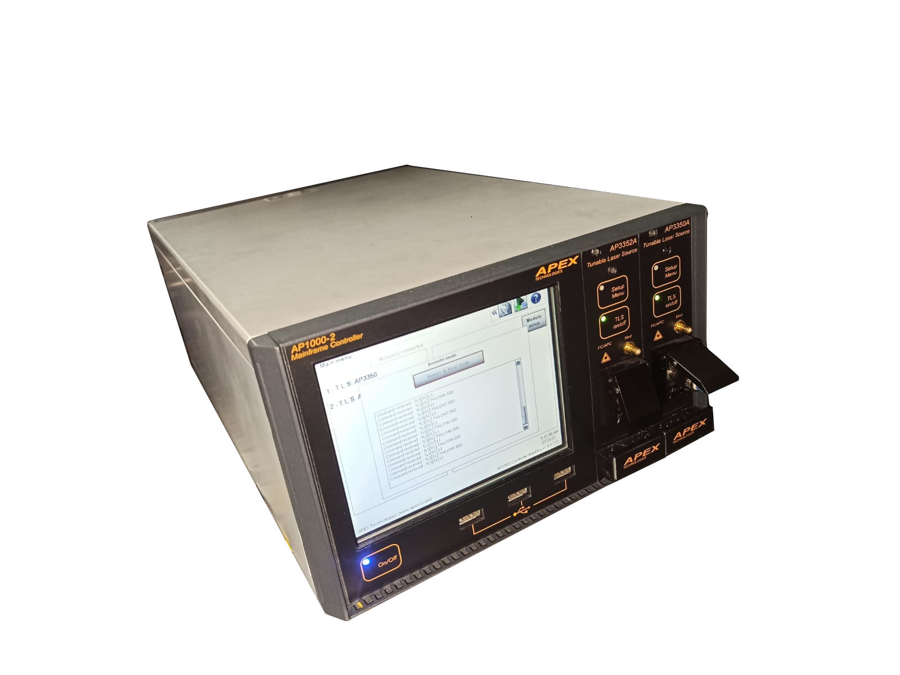
</td>
  </tr>

</tr>
  <td>
PM-1600-High-speed power meter</td>
  <td>
EXFO
</td>
  <td>
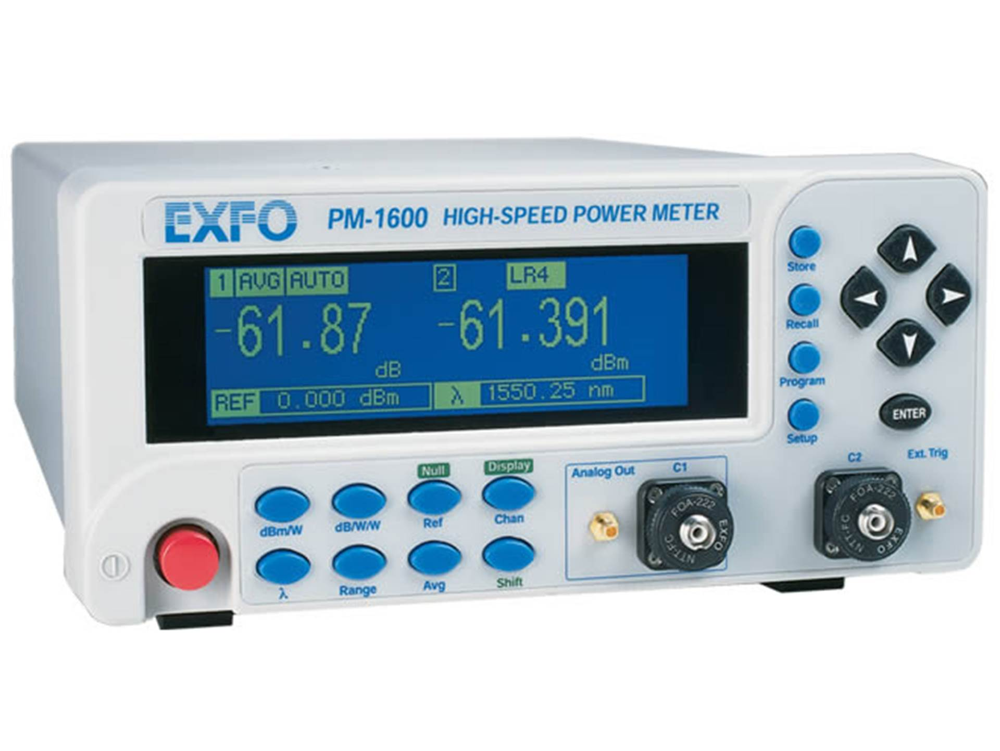
</td>
    
</tr>

  <tr>
    <td>
WiDy SWIR 640 - VGA Camera</td>
    <td>
New Imaging Technologies</td>
    <td>
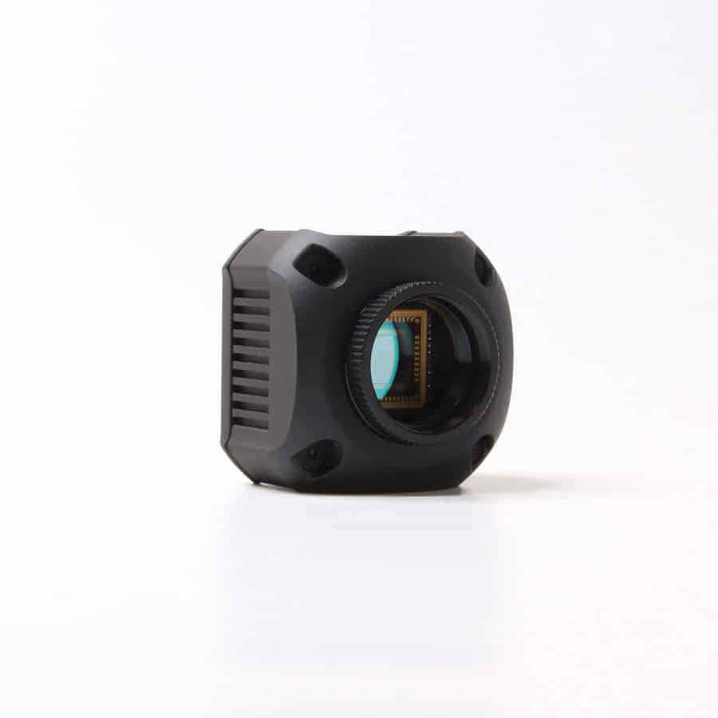
</td></td>
  </tr>
  <tr>
    <td>
Motorized Precision Rotation Mount</td>
    <td>
Thorlabs</td>
    <td>
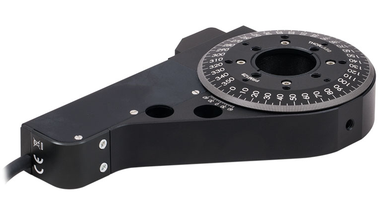
</td></td>
  </tr>
  <tr>
    <td>
T-Cube DC Servo Controller</td>
    <td>
Thorlabs</td>
    <td>

</td></td>
  </tr>
  <tr>
    <td>
Arduino Mega 2560</td>
    <td>
Arduino AG</td>
    <td>

</td></td>
  </tr>
  <tr>
    <td>
Ceramic heater</td>
    <td></td>
    <td>
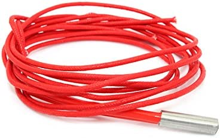
</td></td>
  </tr>
  <tr>
    <td>
Thermistor</td>
    <td></td>
    <td>
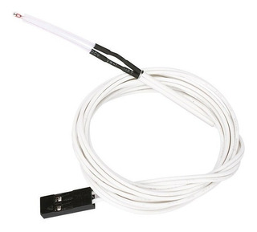
</td></td>
  </tr>
</table>

The user interface enables the following five distinct categories of research and development:

**Example #1: Reconstruction of transmission spectra.**

Here is a step-by-step guide to reconstructing transmission spectra using OptiGUI DataCollector:

**Step 1:** A drop-down menu will appear in the upper-right corner of the GUI, allowing you to select the reference laser source. Two PyApex tunable lasers are available for this example: ref. AP3350A and ref. AP3352A.

**Step 2:** Adjust the output power value of the tunable laser. The power range for these sources is between -30 dBm and +13 dBm.

**Step 3:** Establish the wavelength range based on the source of the reference laser. The wavelength range for Ref. AP3350A should be between 1527 and 1567 nm, and for Ref. AP3352A, it should be between 1567 and 1608 nm.

**Step 4:** Assign the wavelength step value. In this case, the tunable laser has a minimum wavelength step of 1 pm.

**Step 5:** Turn on the power meter by pressing the button that is situated at the very top of the user interface, and then enter exactly the same values for the wavelength range that were established earlier in the optical light source (see Step 3).

**Step 6:** To begin running the software, click the PLAY button on the toolbar. The process of collecting data will now begin, and the transmission spectra will be reconstructed depending on the parameters that have been chosen.

**Fig. 1** illustrates the actions that the user must take when working within the viewing window in order to reconstruct the transmission spectra.

Fig. 1. Step by step reconstruction of the transmission spectra using the OptiGUI DataCollector.

When the GUI execution is finished, the transmission spectrum of the optical fiber device for the given wavelength range will be presented. Thus, the user will be able to view the transmission spectrum as depicted in **Fig. 2** via the software interface.
In addition to displaying the transmission spectral for the assigned wavelength range, the GUI also allows the user to save the acquired data as a **.xlsx** file for further analysis. This feature enables researchers to store and compare data from different experiments easily

 
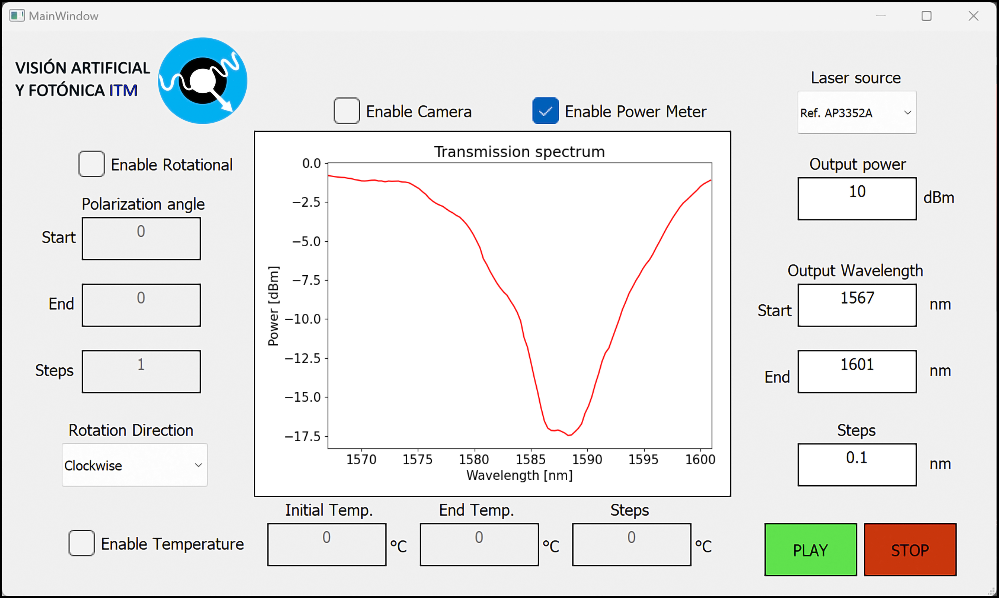

Fig. 2. Transmission spectrum displayed in the GUI.

**Example #2: Measuring transmission spectra at different temperatures using an LPFG.**

**Step 1:** A drop-down menu will appear in the upper-right corner of the GUI, allowing you to select the reference laser source. Two PyApex tunable lasers are available for this example: ref. AP3350A and ref. AP3352A.

**Step 2:** The user has to adjust the tunable laser's output power value within the allowable range of -30 dBm to +13 dBm.

**Step 3:** Establish the wavelength range based on the source of the reference laser. The wavelength range for Ref. AP3350A should be between 1527 and 1567 nm, and for Ref. AP3352A, it should be between 1567 and 1608 nm.

**Step 4:** Assign the wavelength step value. In this case, the tunable laser has a minimum wavelength step of 1 pm.

**Step 5:** Turn on the power meter by pressing the button that is situated at the very top of the user interface, and then enter exactly the same values for the wavelength range that were established earlier in the optical light source (see Step 3).

**Step 6:** The user must activate the temperature control, which is found in the lower left corner of the GUI. Following that, the user must assign the proper temperature range based on the experiment. This module could work at temperatures ranging from room temperature to 170 ºC.

**Step 7:** The user is responsible for assigning the proper temperature step, keeping in mind that the resolution of the thermistor being utilized is restricted to a maximum of 0.3 ºC.

**Step 8:** Finally, the user will need to click on the PLAY button in order to begin the process of executing the program and receiving the transmission spectra that correspond to the chosen temperature and wavelength range.

A graphical illustration of the sequence of steps involved in the reconstruction of transmission spectra at different temperatures is provided in **Fig. 3.** 

 
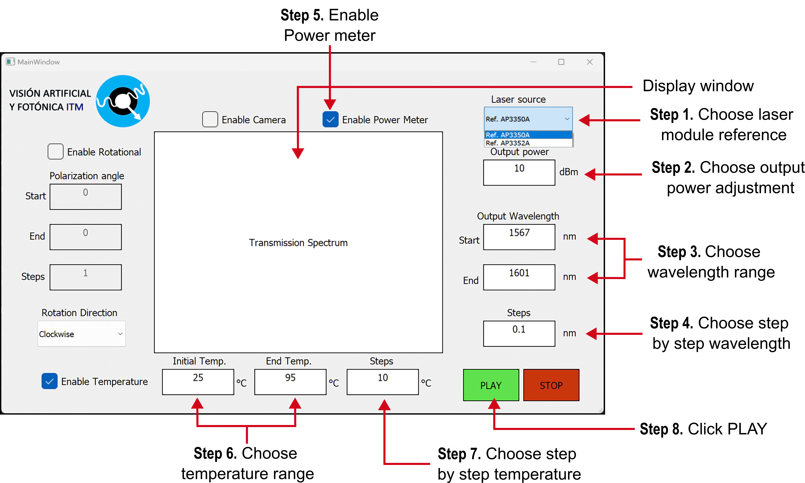

Fig. 3. Capturing images by adjusting the wavelength of a tunable laser.

**Example #3: Capturing images by adjusting the wavelength of a tunable laser.**

**Step 1:** A drop-down menu will appear in the upper-right corner of the GUI, allowing you to select the reference laser source. Two PyApex tunable lasers are available for this example: ref. AP3350A and ref. AP3352A.

**Step 2:** The user has to adjust the tunable laser's output power value within the allowable range of -30 dBm to +13 dBm.

**Step 3:** Establish the wavelength range based on the source of the reference laser. The wavelength range for Ref. AP3350A should be between 1527 and 1567 nm, and for Ref. AP3352A, it should be between 1567 and 1608 nm.

**Step 4:** Assign the wavelength step value. In this case, the tunable laser has a minimum wavelength step of 1 pm.

**Step 5.** To activate the camera, locate and select the button at the top of the Graphical User Interface (GUI). Once the camera is activated, it can be used to capture images. It is important to ensure that the camera is properly connected and configured before activation to ensure optimal performance. Additionally, it is recommended to refer to the user manual or instructions provided by the manufacturer for detailed guidance on the use of the camera and the associated features.

**Step 6.**  Click on Play to run the program. Thus, OptiGUI DataCollector will begin capturing images as the laser's operating wavelength varies.

**Fig. 4** displays the steps in the display window for capturing images at different wavelengths of the tunable laser. During the execution of the GUI, a new display window will be generated, which will show the captured image at the output of the optical fiber for the assigned wavelength.

  
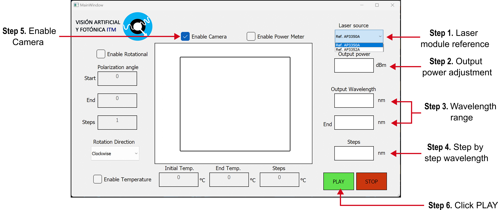

Fig 4. Step by step instructions for capturing images by adjusting the wavelength of a tunable laser using the OptiGUI DataCollector.

**Example #4:** Capturing imaging by adjusting the polarization of light at the output of the optical fiber mode converter. 

**Step 1:** A drop-down menu will appear in the upper-right corner of the GUI, allowing you to select the reference laser source. Two PyApex tunable lasers are available for this example: ref. AP3350A and ref. AP3352A.

**Step 2:** The user has to adjust the tunable laser's output power value within the allowable range of -30 dBm to +13 dBm.

**Step 3:** Establish the wavelength range based on the source of the reference laser. The wavelength range for Ref. AP3350A should be between 1527 and 1567 nm, and for Ref. AP3352A, it should be between 1567 and 1608 nm.

**Step 4:** Assign the wavelength step value. In this case, the tunable laser has a minimum wavelength step of 1 pm.

**Step 5.** To activate the camera, locate and select the button at the top of the Graphical User Interface (GUI). Once the camera is activated, it can be used to capture images. It is important to ensure that the camera is properly connected and configured before activation to ensure optimal performance. Additionally, it is recommended to refer to the user manual or instructions provided by the manufacturer for detailed guidance on the use of the camera and the associated features.

**Step 6.** The user must activate the rotational base; this button is placed on the left side of the GUI.

**Step 7.** The initial angle, the last angle, and the pitch in degrees should each be assigned to the rotational station. Users should take a close look at the manufacturer's specifications to learn about this device's resolution.

**Step 8.** The rotation direction can either be clockwise or counterclockwise.

**Step 9.**  Click on the PLAY button to execute the program.

  
**Fig. 5** displays the steps in the GUI for capturing imaging by adjusting the polarization of light at the output of the optical fiber mode converter. During the execution of the GUI, a new display window will be generated, which will show the captured image at the output of the optical fiber for the assigned wavelength.

 
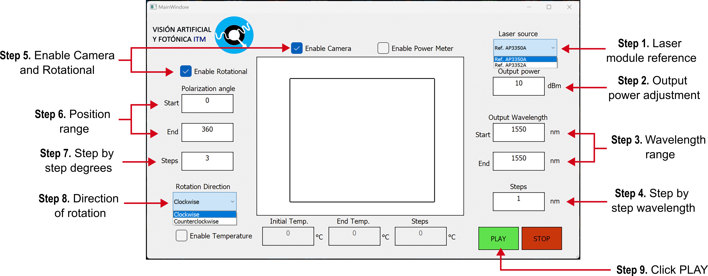

Fig 5. Step-by-step capture of images by adjusting the polarization of light at the output of the optical fiber mode converter using the OptiGUI DataCollector.

**Example #5: Capturing imaging at different temperatures.**

**Step 1:** A drop-down menu will appear in the upper-right corner of the GUI, allowing you to select the reference laser source. Two PyApex tunable lasers are available for this example: ref. AP3350A and ref. AP3352A.

**Step 2:** The user has to adjust the tunable laser's output power value within the allowable range of -30 dBm to +13 dBm.

**Step 3:** Establish the wavelength range based on the source of the reference laser. The wavelength range for Ref. AP3350A should be between 1527 and 1567 nm, and for Ref. AP3352A, it should be between 1567 and 1608 nm.

**Step 4:** Assign the wavelength step value. In this case, the tunable laser has a minimum wavelength step of 1 pm.

**Step 5.** To activate the camera, locate and select the button at the top of the Graphical User Interface (GUI). Once the camera is activated, it can be used to capture images. It is important to ensure that the camera is properly connected and configured before activation to ensure optimal performance. Additionally, it is recommended to refer to the user manual or instructions provided by the manufacturer for detailed guidance on the use of the camera and the associated features.

**Step 6:** The user must activate the temperature control, which is found in the lower left corner of the GUI. Following that, the user must assign the proper temperature range based on the experiment. This module could work at temperatures ranging from room temperature to 170 ºC.

**Step 7:** The user is responsible for assigning the proper temperature step, keeping in mind that the resolution of the thermistor being utilized is restricted to a maximum of 0.3 ºC.

**Step 8.**  Click on the PLAY button to execute the program.

**Fig. 6** depicts the steps in the display window for taking images of modes at the optical fiber's output under various temperature scenarios. During the execution of the GUI, a new display window will be generated, which will show the captured image at the output of the optical fiber for the assigned wavelength. 

 
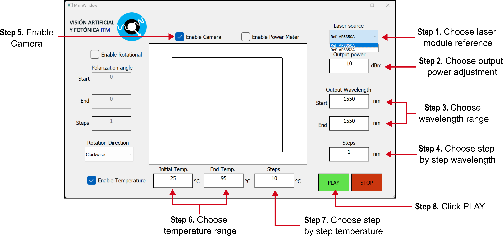

Fig. 6. Step-by-step instructions for capturing images at different temperatures using the OptiGUI DataCollector.

## **License**
This code is licensed under GNU (GPL)
